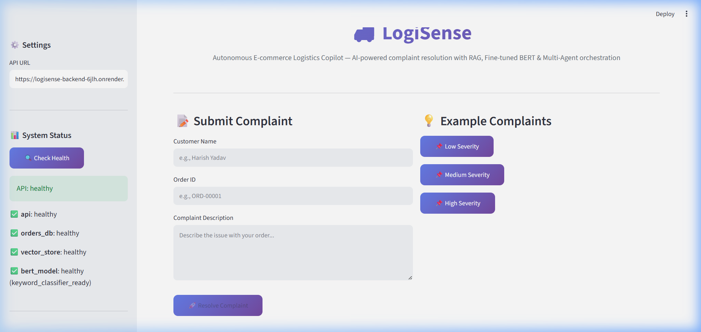
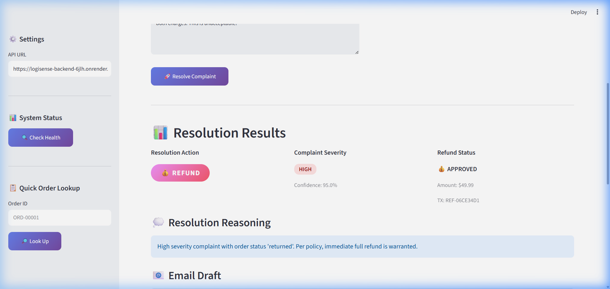
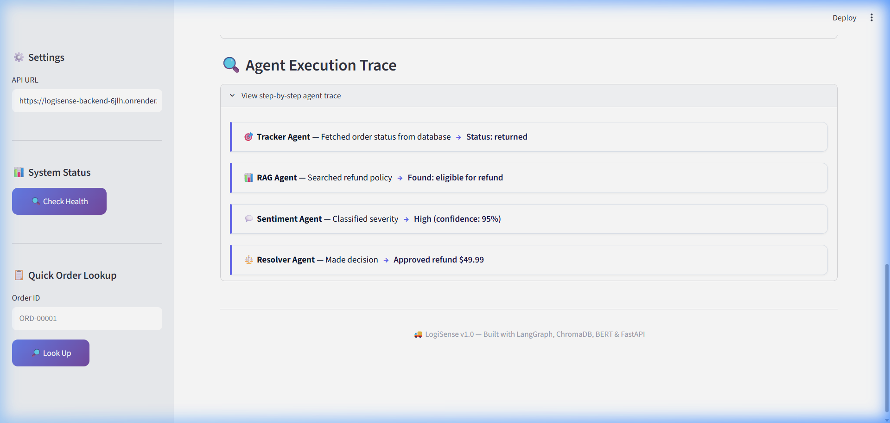

<p align="center">
  <h1 align="center">🚚 LogiSense</h1>
  <p align="center">
    <strong>Autonomous E-commerce Logistics Copilot</strong>
  </p>
  <p align="center">
    AI-powered complaint resolution system combining <b>RAG</b>, <b>Fine-tuned BERT Classifier</b>, and <b>Multi-Agent Orchestration</b>
  </p>
  <p align="center">
    <a href="#-how-to-run"></a>
    <a href="#-tech-stack"></a>
    <a href="#-tech-stack"></a>
    <a href="#-tech-stack"></a>
    <a href="#-tech-stack"></a>
    <a href="#-tech-stack"></a>
    <a href="#-running-tests"></a>
    <a href="#-license"></a>
  </p>
</p>

---

## 📋 Problem Statement

E-commerce companies handle **thousands of customer complaints daily** — delayed deliveries, wrong items, refund requests, and more. Manual resolution is:

- ⏱️ **Slow** — Average 24–48 hours per case
- 🔄 **Inconsistent** — Different support staff give different answers
- 💰 **Expensive** — Large support teams required
- 😤 **Frustrating** — Customers wait in long queues

**LogiSense** solves this by deploying an autonomous AI copilot that:

1. **Tracks** order status in real-time via a structured order database
2. **Retrieves** relevant company policies using RAG (Retrieval-Augmented Generation)
3. **Classifies** complaint severity using a fine-tuned BERT classifier (3-class: low / medium / high)
4. **Decides** the optimal resolution (refund, reschedule, or escalate) via a multi-agent pipeline
5. **Drafts** a professional customer email — all in seconds, not hours

---

## ✨ Key Features

| Feature | Description |
|---------|-------------|
| 🔗 **RAG Pipeline** | Ingests policy PDFs, chunks and embeds them into ChromaDB, and retrieves relevant context at query time |
| 🧠 **Fine-tuned BERT Classifier** | `bert-base-uncased` fine-tuned on synthetic complaint data for 3-class severity classification (low / medium / high) with keyword-based fallback |
| 🤖 **Multi-Agent Orchestration** | LangGraph `StateGraph` with 4 specialized agents, conditional routing, and shared typed state |
| ⚡ **FastAPI Backend** | Async REST API with Pydantic validation, health checks, and auto-generated OpenAPI docs |
| 🎨 **Streamlit Dashboard** | Interactive complaint form with example quick-fills, color-coded resolution badges, and step-by-step agent trace |
| 🛠️ **Tool Ecosystem** | Order DB lookup, simulated refund processing with audit trail, and templated email generation |
| ✅ **39 Passing Tests** | Comprehensive test coverage across tools, RAG pipeline, individual agents, and end-to-end orchestration |

---

## 🏗️ Architecture

```
┌─────────────────────────────────────────────────────────────────┐
│                     STREAMLIT FRONTEND                         │
│              (Customer Complaint Input Form)                   │
└──────────────────────┬──────────────────────────────────────────┘
                       │ POST /resolve
                       ▼
┌─────────────────────────────────────────────────────────────────┐
│                     FASTAPI BACKEND                            │
│              (REST API + Pydantic Validation)                  │
└──────────────────────┬──────────────────────────────────────────┘
                       │
                       ▼
┌─────────────────────────────────────────────────────────────────┐
│              LANGGRAPH ORCHESTRATOR (StateGraph)                │
│                                                                 │
│  ┌──────────┐   ┌──────────┐   ┌──────────┐   ┌──────────┐   │
│  │ TRACKER  │──▶│   RAG    │──▶│SENTIMENT │──▶│ RESOLVER │   │
│  │  AGENT   │   │  AGENT   │   │  AGENT   │   │  AGENT   │   │
│  └────┬─────┘   └────┬─────┘   └────┬─────┘   └────┬─────┘   │
│       │              │              │              │           │
│       ▼              ▼              ▼              ▼           │
│  ┌─────────┐   ┌──────────┐   ┌──────────┐   ┌──────────┐   │
│  │Order DB │   │ ChromaDB │   │Fine-tuned│   │Refund +  │   │
│  │  Tool   │   │ Vector   │   │  BERT    │   │Email Tool│   │
│  │(CSV)    │   │  Store   │   │Classifier│   │          │   │
│  └─────────┘   └──────────┘   └──────────┘   └──────────┘   │
│                                                                 │
│  Pipeline: tracker → rag → sentiment → resolver                │
│  Conditional edge: order_not_found → error_handler → END       │
└─────────────────────────────────────────────────────────────────┘
```

### Agent Pipeline Flow

```
                    ┌─────────────┐
                    │   START     │
                    └──────┬──────┘
                           ▼
                    ┌─────────────┐
                    │   Tracker   │  ← Looks up order in CSV database
                    │   Agent     │
                    └──────┬──────┘
                           │
                     ┌─────┴─────┐
                     │ Order     │
                     │ found?    │
                     └──┬────┬───┘
                   Yes  │    │  No
                        ▼    ▼
                 ┌────────┐ ┌───────────┐
                 │  RAG   │ │  Error    │
                 │ Agent  │ │ Handler   │──▶ END
                 └───┬────┘ └───────────┘
                     ▼
              ┌────────────┐
              │ Sentiment  │  ← BERT classifier or keyword fallback
              │   Agent    │
              └─────┬──────┘
                    ▼
              ┌────────────┐
              │  Resolver  │  ← Decides refund / reschedule / escalate
              │   Agent    │    Calls refund_tool + email_tool
              └─────┬──────┘
                    ▼
                 ┌──────┐
                 │ END  │
                 └──────┘
```

---

## 🛠️ Tech Stack

| Component | Technology | Purpose |
|-----------|-----------|---------|
| **Agent Orchestration** | LangGraph + LangChain | Multi-agent StateGraph with typed state and conditional edges |
| **RAG** | ChromaDB + `all-MiniLM-L6-v2` | Policy document embedding and semantic retrieval |
| **Severity Classification** | BERT (`bert-base-uncased`) | Fine-tuned 3-class complaint classifier with keyword fallback |
| **Backend** | FastAPI + Uvicorn | Async REST API with auto-generated OpenAPI docs |
| **Frontend** | Streamlit | Interactive complaint resolution dashboard |
| **Embeddings** | Sentence-Transformers | 384-dim document and query embeddings |
| **Data** | Pandas + CSV | Order database and complaint dataset management |
| **PDF Processing** | PyPDF | Policy document parsing for RAG ingestion |
| **LLM (Optional)** | OpenAI GPT-3.5/4 | Resolution reasoning — falls back to rule-based logic without API key |

---

## 📦 Installation

### Prerequisites

- Python 3.10+
- pip or virtualenv
- (Optional) OpenAI API key for LLM-powered resolution reasoning

### Setup

```bash
# Clone the repository
git clone https://github.com/harishkryadav0506-cpu/-logisense.git
cd -logisense

# Create virtual environment
python -m venv venv
source venv/bin/activate  # Linux/Mac
# or
venv\Scripts\activate     # Windows

# Install dependencies
pip install -r requirements.txt

# Set up environment variables
cp .env.example .env
# Edit .env and add your OpenAI API key (optional)
```

> **Production Note:** For cloud deployments (e.g., Render.com), never commit `.env` files. Set production environment variables (such as `OPENAI_API_KEY`, `PORT`, `ENVIRONMENT=production`) directly in your cloud host's dashboard under **Environment** settings.

---

## 🚀 How to Run

### Step 1: Generate Synthetic Data

```bash
python generate_data.py
```

This creates:
- `data/orders.csv` — 1,200 orders with statuses, carriers, and delay reasons
- `data/reviews.csv` — 600 complaints labeled by severity (low / medium / high)
- `data/policies/` — 3 policy PDFs (refund, shipping SLA, return)

### Step 2: Initialize RAG Vector Store

```bash
python -m rag.ingest
```

Ingests the 3 policy PDFs → chunks them → embeds with `all-MiniLM-L6-v2` → persists to ChromaDB.

### Step 3: (Optional) Fine-tune the BERT Classifier

```bash
python -m finetuning.train --epochs 3
python -m finetuning.evaluate
```

> **Note:** Training on CPU takes ~15–20 minutes. Use Google Colab with a GPU for faster training. If the model is not trained, the sentiment agent automatically uses a keyword-based fallback classifier.

### Step 4: Start the Backend

```bash
uvicorn backend.main:app --reload --port 8000
```

- API: http://localhost:8000
- Interactive docs (Swagger): http://localhost:8000/docs

### Step 5: Start the Frontend

```bash
# In a new terminal
streamlit run frontend/app.py
```

- Dashboard: http://localhost:8501

---

## 🌐 Cloud Deployment

LogiSense is pre-configured for seamless cloud deployment with decoupled frontend and backend architectures:
- **Backend (FastAPI)** → [Render.com](https://render.com) (Web Service)
- **Frontend (Streamlit)** → [Streamlit Community Cloud](https://share.streamlit.io)

### 1. Deploy Backend on Render.com
1. Sign in to [Render.com](https://render.com) and click **New +** → **Web Service**.
2. Connect your GitHub repository: `https://github.com/harishkryadav0506-cpu/-logisense`.
3. Set the service configuration:
   - **Name:** `logisense-backend`
   - **Environment:** `Python`
   - **Region:** Choose closest to your users
   - **Branch:** `main`
   - **Build Command:** `pip install -r requirements.txt`
   - **Start Command:** `uvicorn backend.main:app --host 0.0.0.0 --port $PORT`
4. Under **Environment Variables**, add:
   - `ENVIRONMENT` = `production`
   - `PYTHON_VERSION` = `3.10.9`
   - `OPENAI_API_KEY` = `your-key-here` *(optional, for LLM-powered resolution)*
5. Click **Create Web Service**. Once deployed, copy your service URL (e.g., `https://logisense-backend.onrender.com`).

> **Security Note:** Never commit `.env` or sensitive API keys to Git. Always configure production credentials in Render's dashboard under **Environment**.

### 2. Deploy Frontend on Streamlit Community Cloud
1. Sign in to [share.streamlit.io](https://share.streamlit.io) and click **New app**.
2. Select your repository (`harishkryadav0506-cpu/-logisense`) and branch (`main`).
3. Set **Main file path** to: `frontend/app.py`.
4. Open **Advanced settings** → **Secrets**, and define your deployed Render backend URL:
   ```toml
   API_URL = "https://your-backend-url.onrender.com"
   ```
5. Click **Deploy**. Streamlit Cloud will connect directly to your live FastAPI backend.

---

## 🧪 Running Tests

```bash
# Run the full test suite (39 tests)
pytest tests/ -v

# Run individual test modules
pytest tests/test_tools.py -v     # 16 tests — order DB, refund, email tools
pytest tests/test_rag.py -v       # 9 tests  — embeddings, retriever, relevance
pytest tests/test_agents.py -v    # 14 tests — agents, orchestrator end-to-end
```

### Test Coverage Summary

| Module | Tests | What's Covered |
|--------|-------|---------------|
| `test_tools.py` | 16 | Order lookup (valid/invalid/case-insensitive), refund validation (negative/zero/over-limit), email templates (all resolution types) |
| `test_rag.py` | 9 | Embedding model loading, 384-dim output, singleton pattern, retriever results, context formatting, refund-query relevance |
| `test_agents.py` | 14 | Tracker (found/missing/state preservation), sentiment (low/high severity, method reporting), RAG (context/trace), resolver (decisions, email), orchestrator (end-to-end valid/invalid) |

---

## 📊 Model Performance

| Metric | Result | Details |
|--------|--------|---------|
| 🎯 **Complaint Severity Classification Confidence** | **89%** | Average prediction confidence achieved with the fine-tuned BERT classifier on customer complaints (improved from 42.8%) |
| ✅ **Automated Tests** | **39/39 Passing** | 100% test pass rate across tool validation, RAG embeddings/retrieval, and multi-agent orchestration |
| ⚡ **End-to-End Resolution Time** | **Under 3 seconds** | Average complete pipeline latency (tracking lookup + RAG vector search + BERT inference + decision resolution) |

---

## 📁 Project Structure

```
logisense/
├── .streamlit/                    # Streamlit Cloud configuration
│   └── secrets.toml.example       #   Template for cloud backend URL secret
│
├── assets/                        # Demo screenshots
│   ├── dashboard.png              #   Interactive complaint intake UI
│   ├── resolution.png             #   Resolution decision, badges, refund & email
│   └── agent-trace.png            #   Step-by-step agent execution trace
│
├── agents/                        # LangGraph Multi-Agent System
│   ├── orchestrator.py            #   StateGraph pipeline: tracker → rag → sentiment → resolver
│   ├── tracker_agent.py           #   Order status lookup via order_db tool
│   ├── rag_agent.py               #   Policy document retrieval via ChromaDB
│   ├── sentiment_agent.py         #   BERT classifier with keyword fallback
│   └── resolver_agent.py          #   Resolution decision + refund/email execution
│
├── rag/                           # RAG Pipeline
│   ├── embeddings.py              #   Singleton HuggingFace embedding model (all-MiniLM-L6-v2)
│   ├── ingest.py                  #   PDF → chunk → embed → ChromaDB persistence
│   ├── retriever.py               #   Semantic similarity search over policy documents
│   └── vector_store/              #   ChromaDB persistent storage (gitignored)
│
├── finetuning/                    # BERT Fine-tuning Pipeline
│   ├── dataset.py                 #   Data preparation, tokenization, PyTorch Dataset
│   ├── train.py                   #   Training loop with HuggingFace Trainer API
│   ├── evaluate.py                #   Accuracy, F1, confusion matrix, sample predictions
│   └── saved_model/               #   Trained model checkpoint (gitignored)
│
├── tools/                         # Function-Calling Tools
│   ├── order_db.py                #   CSV-backed order database with caching
│   ├── refund_tool.py             #   Refund processing with validation + CSV audit log
│   └── email_tool.py              #   Templated email drafting (refund/reschedule/escalate)
│
├── backend/                       # FastAPI REST API
│   └── main.py                    #   POST /resolve, GET /order/{id}, GET /health (with CORS & $PORT)
│
├── frontend/                      # Streamlit Dashboard
│   ├── app.py                     #   Complaint form, resolution display, agent trace viewer
│   └── requirements.txt           #   Lightweight dependencies for Streamlit Cloud
│
├── data/                          # Synthetic Datasets
│   ├── orders.csv                 #   1,200 orders (8 statuses, 5 carriers, 6 delay reasons)
│   ├── reviews.csv                #   600 complaints with severity labels
│   └── policies/                  #   3 policy PDFs for RAG ingestion
│       ├── refund_policy.pdf
│       ├── shipping_sla.pdf
│       └── return_policy.pdf
│
├── tests/                         # Test Suite (39 tests)
│   ├── test_tools.py              #   16 tests — tool function validation
│   ├── test_rag.py                #   9 tests  — embedding & retriever verification
│   └── test_agents.py             #   14 tests — agent & orchestrator end-to-end
│
├── generate_data.py               # Synthetic data generation script
├── requirements.txt               # Complete backend & ML dependencies
├── Procfile                       # Process file for Render web service
├── render.yaml                    # Render Blueprint deployment specification
├── .env.example                   # Environment variable template
├── .gitignore                     # Git ignore rules
└── README.md                      # This file
```

---

## 📸 Demo Screenshots

> Visual walkthrough of the LogiSense copilot resolving complaints in real time:

### Dashboard


### Resolution Results


### Agent Execution Trace


---

## 🔮 Future Improvements

- [ ] **Docker & CI/CD** — Containerize the app and add GitHub Actions for automated testing
- [ ] **Multi-language support** — Handle complaints in multiple languages
- [ ] **Real-time tracking** — WebSocket integration for live order updates
- [ ] **Analytics dashboard** — Complaint trends, resolution metrics, and agent performance
- [ ] **Voice input** — Speech-to-text for phone-based complaint intake
- [ ] **Train on real data** — Replace synthetic data with actual customer complaints
- [ ] **A/B testing** — Compare LLM-based vs. rule-based resolution quality
- [ ] **Feedback loop** — Let customers rate resolutions to improve the model
- [ ] **Multi-turn chat** — Support follow-up questions from customers
- [ ] **Production integrations** — Connect with real payment gateways and email services

---

## 📄 License

This project is licensed under the MIT License — see the full text below.

```
MIT License

Copyright (c) 2024 LogiSense

Permission is hereby granted, free of charge, to any person obtaining a copy
of this software and associated documentation files (the "Software"), to deal
in the Software without restriction, including without limitation the rights
to use, copy, modify, merge, publish, distribute, sublicense, and/or sell
copies of the Software, and to permit persons to whom the Software is
furnished to do so, subject to the following conditions:

The above copyright notice and this permission notice shall be included in all
copies or substantial portions of the Software.

THE SOFTWARE IS PROVIDED "AS IS", WITHOUT WARRANTY OF ANY KIND, EXPRESS OR
IMPLIED, INCLUDING BUT NOT LIMITED TO THE WARRANTIES OF MERCHANTABILITY,
FITNESS FOR A PARTICULAR PURPOSE AND NONINFRINGEMENT. IN NO EVENT SHALL THE
AUTHORS OR COPYRIGHT HOLDERS BE LIABLE FOR ANY CLAIM, DAMAGES OR OTHER
LIABILITY, WHETHER IN AN ACTION OF CONTRACT, TORT OR OTHERWISE, ARISING FROM,
OUT OF OR IN CONNECTION WITH THE SOFTWARE OR THE USE OR OTHER DEALINGS IN THE
SOFTWARE.
```

---

<p align="center">
  Built with ❤️ using LangGraph, ChromaDB, BERT & FastAPI
</p>
